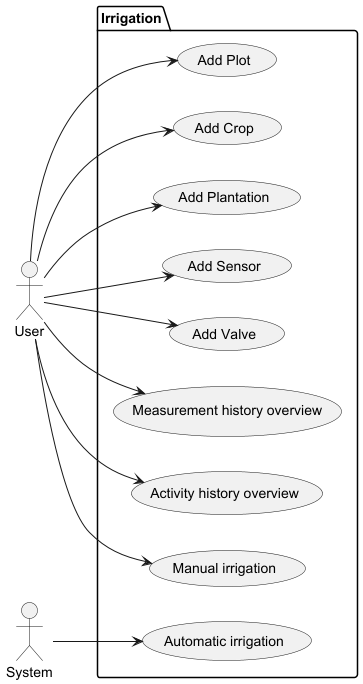
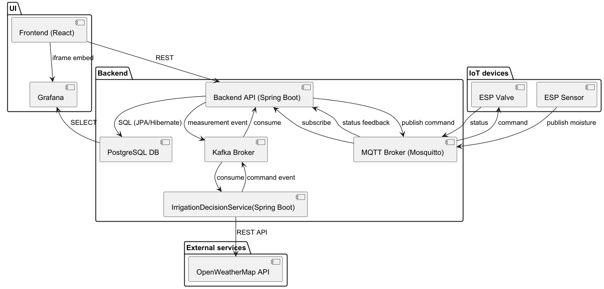
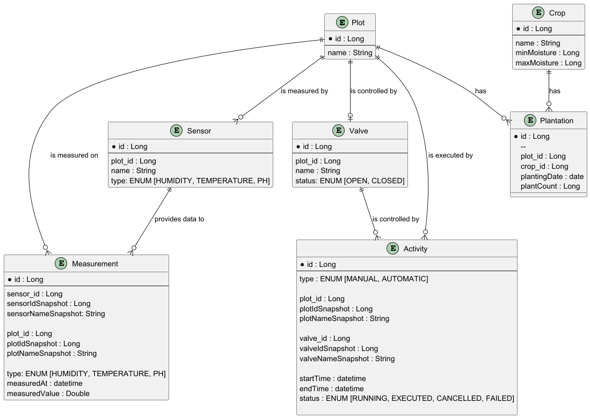
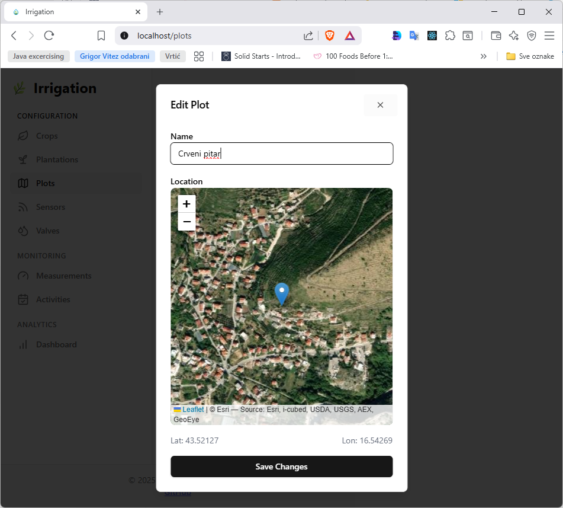
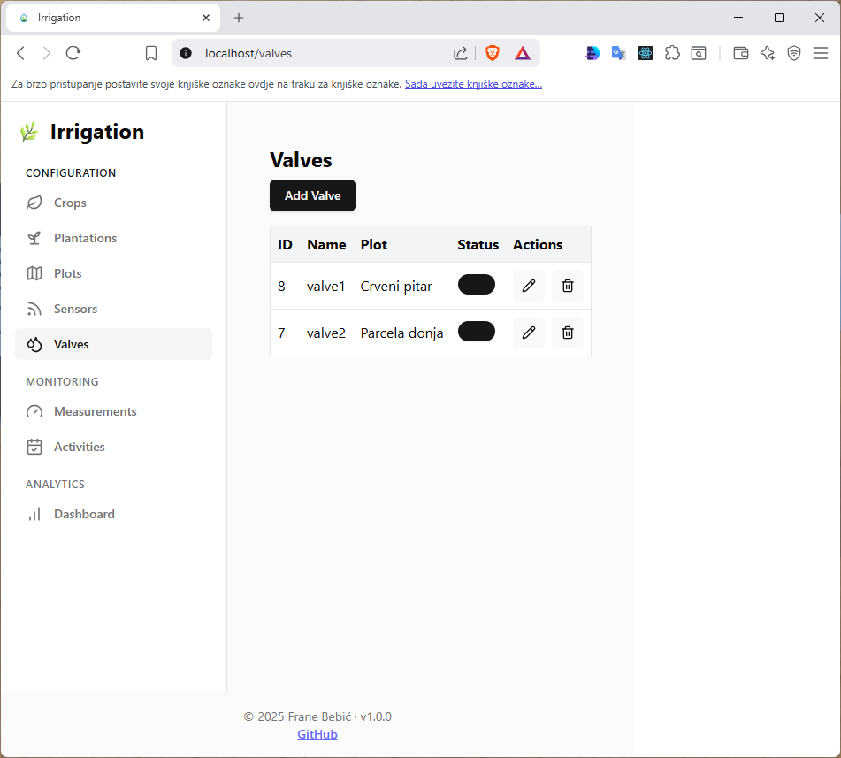
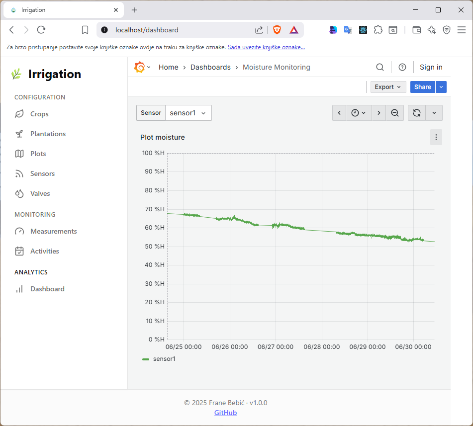
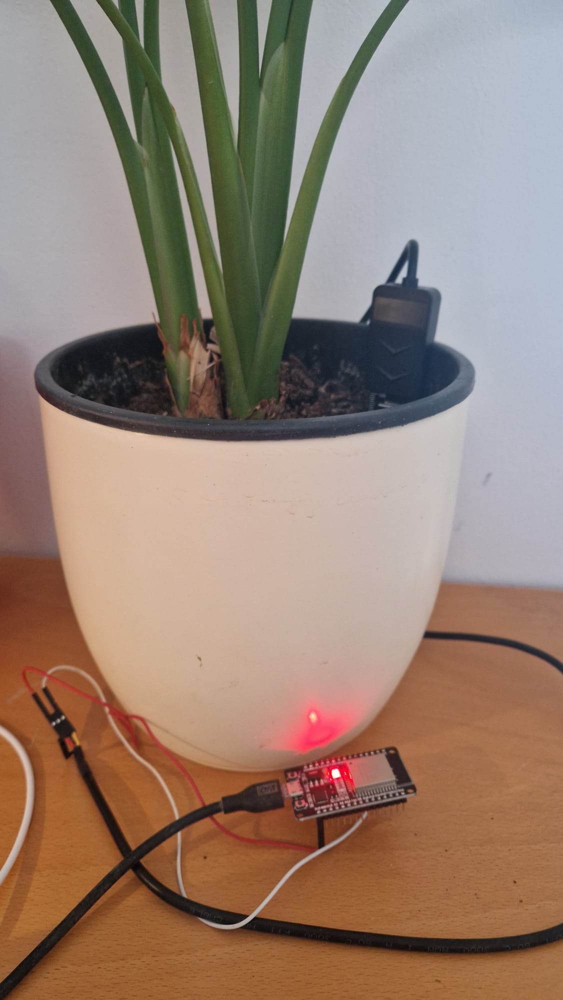
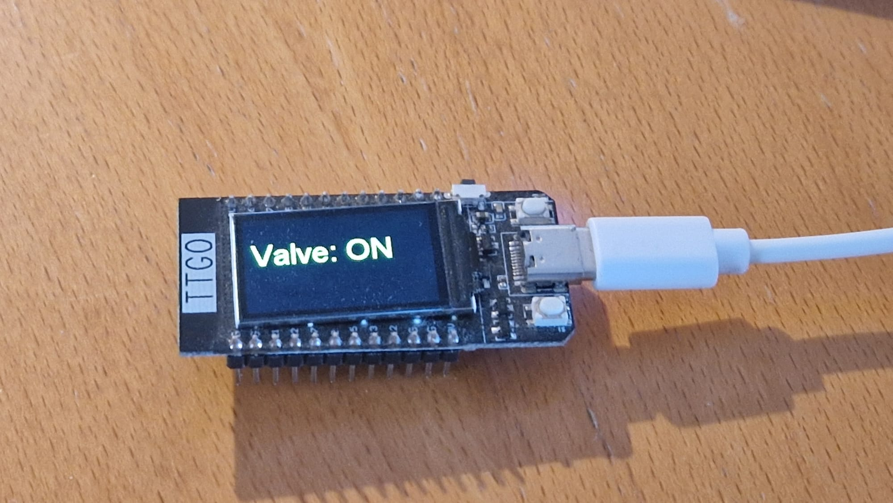

# 🌱 Smart Irrigation System

A modular and extensible system for automated irrigation, combining IoT (ESP32 + MQTT), Spring Boot backend, and a React frontend. It enables real-time soil moisture monitoring, manual or automatic irrigation control, and weather-aware decision making.

---

## 📌 Technologies Used

- Spring Boot (Java 17)
- PostgreSQL
- Apache Kafka
- React
- Docker + Docker Compose
- Grafana (visualization)
- ESP32 with ESPHome
- MQTT (Mosquitto broker)
- OpenWeatherMap API

---

## 🎯 Key Features

- 📈 Real-time soil moisture tracking
- 💧 Manual and automatic irrigation
- 🧠 Rule-based decision engine (Easy Rules)
- 📍 Plot selection via interactive map
- 🔄 IOT communication via MQTT
- 📊 Grafana dashboard embedding
- ☁️ Weather-based irrigation logic

---

## 🔍 Use Case Diagram



---

## 🧠 Service Architecture



---

## 🗂️ Entity Relationship Diagram



---

## 🏁 Getting Started

### 1. Clone the repository

```bash
git clone https://github.com/franebebic/Irrigation.git
cd irrigation
```

### 2. Start with Docker Compose

```powershell
docker-compose up --build
```

### 3. Access the system

- Frontend (React): `http://localhost:80`
- pgAdmin: `http://localhost:5432`
- Grafana: `http://localhost:3001`

---

## 📡 ESPHome YAML Examples

Located in the `iot/esp/` folder:

- `esp_sensor.yaml`: Soil moisture sensor config
- `esp_valve.yaml`: Irrigation valve control config

MQTT is used for communication between devices and backend.

---

## 📘 Backend Services

- `ActivityService`: Tracks valve activations
- `SensorService`: Handles sensor data ingestion
- `ValveService`: Sends open/close commands
- `IrrigationDecisionService`: Rule engine consuming measurement events from Kafka and issuing commands

---

## 📦 Data Model Overview

Main domain entities:

- `Plot`: A defined garden area
- `Sensor`: Measures moisture/temperature/pH on a plot
- `Valve`: Controls irrigation for a plot
- `Crop`: Type of plant with optimal moisture range
- `Plantation`: A crop planted on a specific plot
- `Measurement`: Sensor readings
- `Activity`: Irrigation actions (manual or automatic)

---

## 📊 Visualization

Grafana dashboards are embedded into the frontend to display real-time data and history using PostgreSQL as a data source.

---

## 🖼️ Screenshots

### Web Application UI

*Editing plot location for the precise Weather forecast.*


*Manual valve control interface.*


*Example of the irrigation dashboard.*

---

### 📷 Real Devices


*ESP32 with capacitive soil moisture sensor.*


*ESP32 connected to a solenoid valve via relay.*

---

## ✅ Roadmap

- [x] MQTT communication with ESP devices
- [x] Rule-based irrigation engine
- [x] Interactive map for plot definition
- [x] Measurement history
- [ ] Multitenant environment
- [ ] User notifications (email/SMS)
- [ ] Mobile-optimized frontend
- [ ] Admin dashboard for rule tuning

---

## 👤 Author

**Frane Bebić**  
Split, Croatia  
[LinkedIn](https://www.linkedin.com/in/franebebic)

---

## 📄 License

MIT License. Feel free to use, modify, and distribute.